# ScheduleManager

**ScheduleManager** — это веб-приложение для создания, редактирования и просмотра расписания занятий в образовательных учреждениях.

Приложение позволяет администраторам гибко составлять расписание, контролируя занятость преподавателей и аудиторий, а студенты и преподаватели могут удобно просматривать текущие занятия онлайн.

---

## Используемый стек технологий

| Технология    | Назначение |
|---------------|------------|
| **Java Spring Boot** | Основной фреймворк для разработки веб-приложения |
| **Thymeleaf** | Шаблонизатор для генерации HTML-страниц |
| **Bootstrap** | Библиотека для удобной стилизации интерфейса |
| **PostgreSQL** | Надёжная реляционная база данных |

---

## Сущности системы

Каждое занятие обладает следующими обязательными параметрами:

- Для какой учебной группы оно проводится
- Дисциплина занятия
- Преподаватель
- Аудитория

**Схема сущностей:**

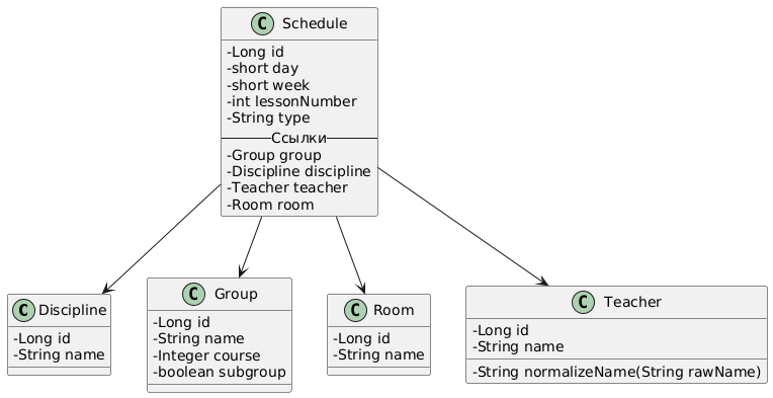

---

## Структура базы данных

Основная таблица **schedule** содержит ссылки на связанные сущности.  
Отношения между таблицами построены по схеме **«один ко многим»**.

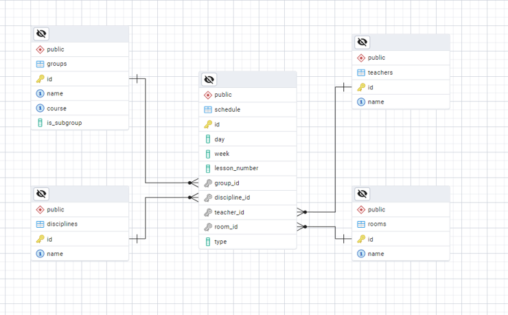

---

## Модель пользователей

- **Пользователи (студенты/преподаватели)** — могут только просматривать расписание
- **Администратор** — имеет доступ к управлению сущностями и редактированию расписания

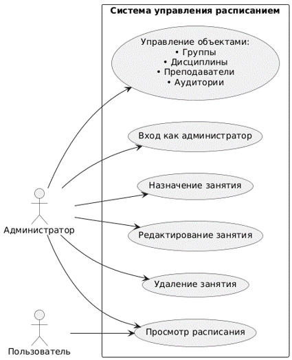

---

## Функционал администратора: управление объектами

Перед заполнением расписания необходимо добавить:

- Учебные группы
- Дисциплины
- Аудитории
- Преподавателей

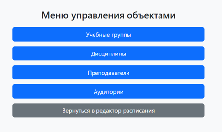
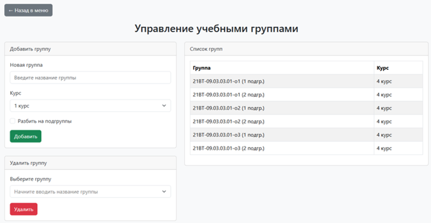

---

## Функционал администратора: редактирование расписания

На странице редактирования расписания можно:

- Выбирать курс
- Переключать день недели
- Сменять чётность недели
- Добавлять и изменять занятия

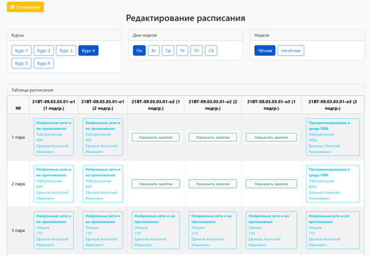

---

## Назначение и редактирование занятия

При нажатии на «Назначить занятие» открывается форма для ввода параметров занятия.

- В форме редактирования также доступна функция удаления занятия.

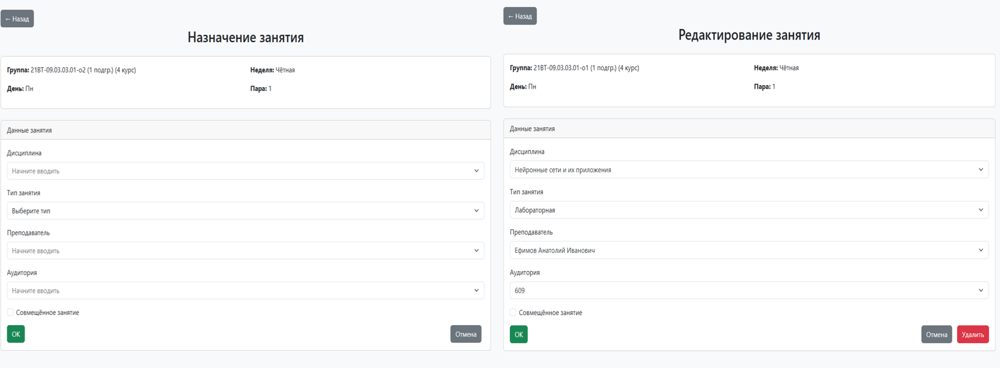

---

## Проверка занятости

Система проверяет:

- Не занята ли уже выбранная аудитория в этот момент
- Не ведёт ли преподаватель другое занятие

Если конфликт есть — появится предупреждение.  
При необходимости можно установить чекбокс для **совмещённого занятия для нескольких групп**.

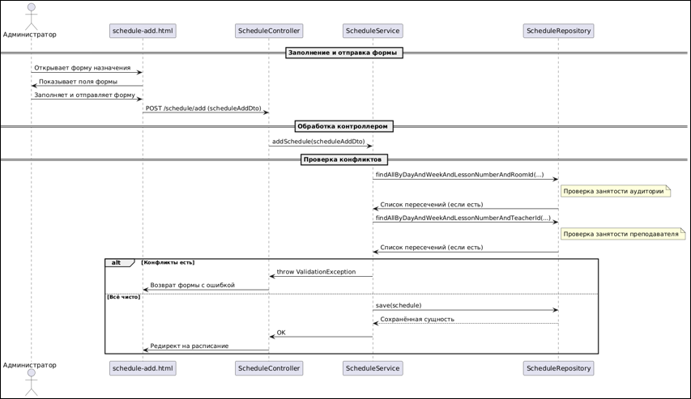

---

## Просмотр расписания

Для просмотра расписания необходимо:

1. Выбрать нужную группу или преподавателя
2. Переключаться между чётной/нечётной неделями

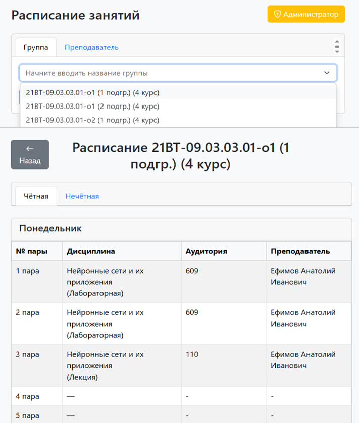
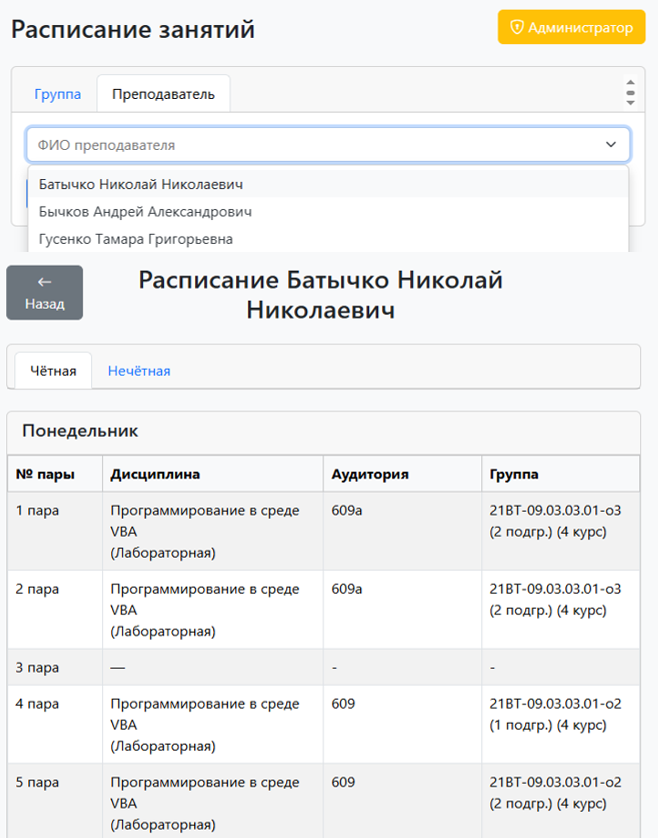

---

## Авторизация администратора

Для разграничения доступа реализована авторизация:

- При попытке перейти на административную страницу без авторизации пользователь перенаправляется на страницу **«Доступ запрещён»**
- Состояние входа хранится в **HttpSession**

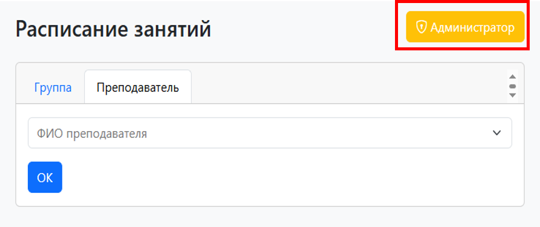

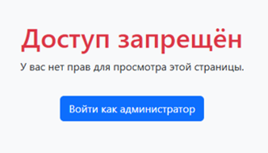

---
